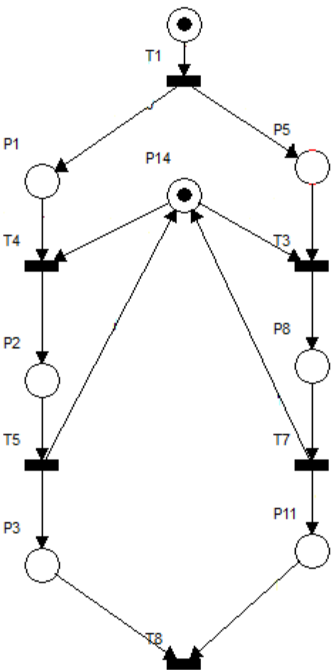

# str-sm-lab4
STR Laborator 4

## Exercițiul 1
#### Cerinţe
Se consideră rețeaua Petri temporizată din figura de mai jos. Aplicația care va fi implementată
în Java SE, pe baza acestei rețele va folosi ca mecanism de sicronizare **excluderea mutuală**
(synchronized), apoi cu **Lock** si apoi cu **Semaphore**, pentru elementul de sincronizare din locația
P14.
Sincronizarea din T12 se va implementa cu ajutorul clasei **CountDownLatch** si apoi
CyclicBarrier

## Exercițiul 2
#### Descriere
Simulaţi o aplicaţie bancară minimă în care mai multe thread-uri fac operaţii de credit și debit asupra soldurilor.

#### Cerinţe
Iniţializaţi ConcurrentHashMap<Integer, Double> cu 10 conturi (cheia = ID client, valoarea = sold iniţial de 1000.0).
Porniţi 5 thread-uri care, în total, efectuează 1 000 de operaţii (aleator credit/debit între 1 și 100).
Fiecare operaţie trebuie să actualizeze soldul în mod atomic.
La final, verificaţi și afişaţi suma totală a tuturor soldurilor.

#### Asigurați-vă că:
Corectitudine (suma totală = 10 000.0 – diferență doar datorită debitorilor).
Folosirea ConcurrentHashMap şi metodei compute() sau merge().
Tratarea cazului de sold negativ (opțional).

## Exercițiul 3
#### Descriere:
Simulaţi un joc în care mai multe thread-uri pasează o bilă între două containere thread-safe.

#### Cerinţe:
Utilizaţi două BlockingQueue<Ball> (capacitate 1) între jucători A şi B.
Fiecare thread A trimite o „minge” (un obiect simplu) către B și apoi aşteaptă să primească mingea înapoi.
Repetaţi de 100 de ori și cronometraţi durata de execuţie.

#### Asigurați-vă că:
Blocările corecte cu take() și put() funcționează corect.
Evitaţi dead-lock-ul.

## Exercițil 4
#### Descriere
Fie o parcare cu N locuri. Mai multe mașini vin și pleacă simultan, dar nu pot ocupa mai mult de N locuri. 
Gestionați acest lucru cu un Semaphore.

#### Cerinţe
Definește clasa ParkingLot cu un atribut Semaphore _slots_ inițializat la N (de ex. N = 5).
Clasa Car implementează Runnable:
-la start încearcă slots.acquire(); 
-dacă a obținut permisul, afișează „Car-ID X a parcat” și stă un timp aleator (2–4s);
- apoi eliberează prin slots.release() și afișează „Car-ID X a plecat”.
În main, lansați 10 thread-uri de tip Car (ID de la 1 la 10) și așteptați terminarea.
Verificați, prin mesaje în consolă, că nu mai mult de 5 mașini sunt parcare în același timp.

#### Extinderi
Implementaţi un sistem de coadă de așteptare: dacă toate locurile sunt ocupate, mașina stă blocată (implicit cu acquire()), apoi afișează „Car-ID X așteaptă”.
Adăugați un timer: după 5 secunde de așteptare, mașina renunță și pleacă.

## Exercițil 5
Sincronizare faze de lucru cu CyclicBarrier

#### Descriere
Simulați un concurs cu 3 etape pe care un grup de 4 concurenți le parcurg în paralel. Fiecare etapă presupune un lucru (sleep aleator între 500–1500 ms), iar apoi toți trebuie să aștepte până când toți ceilalți termină etapa respective, înainte de a trece la următoarea.

#### Cerinţe obligatorii
Creați un CyclicBarrier barrier = new CyclicBarrier(4, () -> System.out.println("Toţi au terminat etapa curentă\n"));
Clasa Competitor implementeză Runnable:
- Pentru fiecare dintre cele 3 etape:
- Afișează „Competitor-ID X începe etapa Y”
- simulare „lucrează” (Thread.sleep(...))
- Afișează „Competitor-ID X a terminat etapa Y”
- Apelează barrier.await()
În main, lansați 4 thread-uri de tip Competitor și așteptați terminarea lor.
La sfârșit, afișați „Concurs finalizat!”.

#### Asigurați-vă că:
Corectitudine sincronizare: nimeni nu trece la etapa următoare înaintea altora.
Folosirea mecanismului Runnable și a executorului de thread-uri (ExecutorService).
Tratarea excepțiilor specifice (BrokenBarrierException, InterruptedException).

## Exercițil 6
Agregator paralel de statistici din fișiere text

#### Descriere
Creaţi o aplicaţie Java care, în paralel, citeşte mai multe fișiere text dintr-un director, calculează pentru fiecare fișier numărul de apariții ale unui set de cuvinte-cheie şi apoi înscrie rezultatele într-un fişier comun de raport. Sincronizarea accesului la fișierul de raport trebuie realizată cu un ReentrantLock.
În directorul input/ există M fișiere text (.txt), fiecare cu câteva sute de linii.

#### Cerinţe
Avem un set fix de K cuvinte-cheie (ex. ["Java", "thread", "lock", "file"]).
Pentru fiecare fișier, un thread separat va:
- Deschide fișierul și numără, linie cu linie, aparițiile fiecărui cuvânt-cheie.
- Construiește un raport parțial de forma:
file1.txt: Java=12, thread=3, lock=5, file=8

- Așteaptă să obțină Lock-ul înainte de a deschide (new FileWriter("report.txt", true)) și a adăuga raportul parțial în fișierul report.txt, pe o noua linie.
- Eliberează Lock-ul imediat după ce a închis writer-ul.

La final, aplicaţia va afișa în consolă:
- Numărul total de fișiere procesate.
- Timpul total de execuție.

